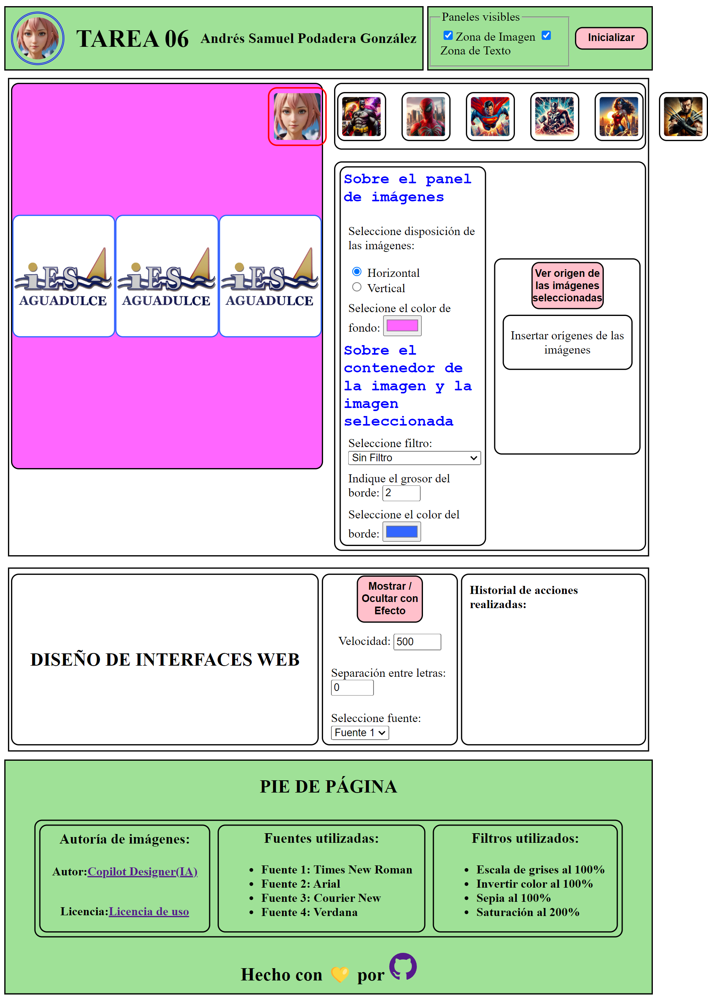

# C.F.G.S. Desarrollo de Aplicaciones Web - Curso 2023-2024

## Módulo: Diseño de Interfaces Web

### Tarea Unidad 6: Contenidos web interactivos

#### Imagen del proyecto:

> **Tecnologías utilizadas**:
>
> - HTML5
> - CSS3
> - JavaScript
> - jQuery

#### Autor: Andrés Samuel Podadera González

### Repositorio GitHub: [DIW](https://github.com/andresito87/DIW)
